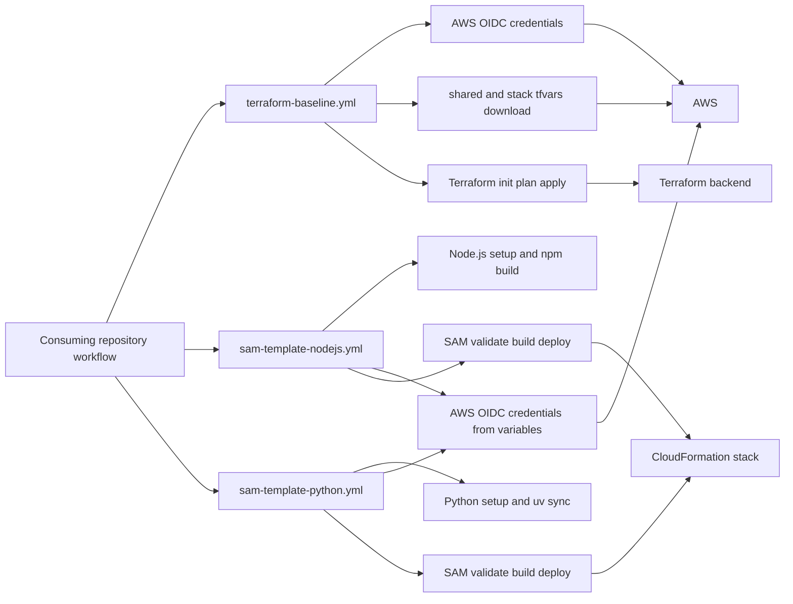

# Architecture

<!-- This diagram shows how consuming repositories call the reusable workflow entry points and which external systems each workflow uses. -->

## Major Components

- `.github/workflows/terraform-baseline.yml`
  - Reusable Terraform workflow invoked through `workflow_call`.
  - Runs on `ubuntu-latest`.
  - Uses OIDC AWS authentication with `secrets.SHARED_SERVICES_OIDC_ARN`.
  - Checks out the caller repository, downloads shared and stack tfvars from S3,
    installs Terraform, runs `terraform init`, then runs either `terraform plan`
    or `terraform apply` with the shared file first and the stack file second.
- `.github/workflows/sam-template-nodejs.yml`
  - Reusable AWS SAM workflow for Node.js applications.
  - Installs the requested Node.js version, sets up the SAM CLI, configures AWS credentials, runs `npm ci`, runs `npm run build`, validates the SAM template, builds the SAM application, deploys it, and prints stack outputs.
  - Resolves the role ARN from `vars.BASELINE_ACCOUNT_MAPPINGS`, `inputs.environment-slug`, and `vars.OIDC_ROLE_NAME`.
- `.github/workflows/sam-template-python.yml`
  - Reusable AWS SAM workflow for Python applications.
  - Installs Python `3.14`, sets up the SAM CLI, configures AWS credentials, installs `uv`, runs `uv sync`, validates the SAM template, builds the SAM application, deploys it, and prints stack outputs.
  - Resolves the role ARN from `vars.BASELINE_ACCOUNT_MAPPINGS`, `inputs.environment-slug`, and `vars.OIDC_ROLE_NAME`.
- Consuming repository workflow
  - Owns triggers, branch policy, environment selection, source code, Terraform files, SAM templates, dependency manifests, and caller-specific inputs.
  - Invokes these workflows with `uses: .../.github/workflows/<workflow>.yml@main`.

## Key Design Decisions

- Keep shared GitHub Actions behavior in one repository.
- Keep application code, Terraform code, SAM templates, and environment-specific configuration in consuming repositories.
- Use OIDC instead of long-lived static AWS credentials.
- Keep Terraform state key construction predictable with `state-key-prefix` plus `environment-slug`.
- Keep stack-specific S3 tfvars lookup predictable with `stack-repository` plus `stack-name`.
- Preserve backend namespaces during caller directory moves; changing `working-directory`
  must not create a new state path.
- Let SAM workflows derive AWS role ARNs from caller-provided variables instead of storing static role ARNs in this repository.
- Keep runtime-specific SAM workflows separate because Node.js and Python dependency setup differ.

## External Dependencies

- GitHub Actions runner image: `ubuntu-latest`
- `actions/checkout@v4`
- `actions/setup-node@v4`
- `actions/setup-python@v5`
- `aws-actions/configure-aws-credentials@v4`
- `aws-actions/setup-sam@v2`
- `astral-sh/setup-uv@v3`
- `hashicorp/setup-terraform@v3`
- Terraform CLI installed through `hashicorp/setup-terraform`
- AWS SAM CLI installed through `aws-actions/setup-sam`
- AWS OIDC and roles supplied by the caller secret or caller variables
