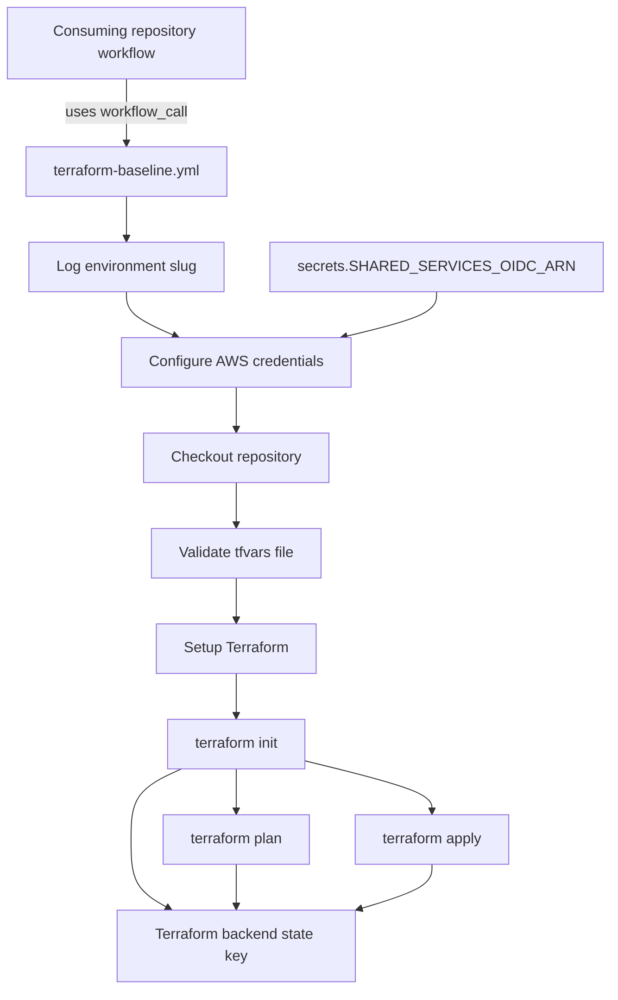

# Architecture

<!-- This diagram shows how a consuming repository invokes the reusable workflow and how the workflow moves through auth, validation, and Terraform execution. -->

## Major Components

- `terraform-baseline.yml`
  - The only executable artifact in this repository.
  - Defines a `workflow_call` reusable workflow.
  - Runs on `ubuntu-latest`.
- Consuming repository workflow
  - Owns branch triggers, environment selection, and caller-specific inputs.
  - Supplies `state-key-prefix`, `tfvars-file`, `environment-slug`, and other workflow inputs.
  - Makes `SHARED_SERVICES_OIDC_ARN` available through the caller secret context.
- AWS authentication
  - Uses `aws-actions/configure-aws-credentials@v4`.
  - Relies on OIDC instead of long-lived static credentials.
- Terraform execution
  - Uses `hashicorp/setup-terraform@v3`.
  - Runs `terraform init` with a backend key derived from `state-key-prefix` and `environment-slug`.
  - Runs `terraform plan` or `terraform apply` based on the `action` input.
- tfvars validation
  - Fails before Terraform runs if the referenced tfvars file is missing relative to `working-directory`.

## Key Design Decisions

- Keep the workflow reusable and repository-agnostic.
- Push account-specific selection into consuming repositories.
- Fail fast on missing tfvars files.
- Gate apply behavior behind an explicit `action` input.
- Keep Terraform state naming predictable with `state-key-prefix` plus `environment-slug`.

## External Dependencies

- GitHub Actions runner image: `ubuntu-latest`
- `actions/checkout@v4`
- `aws-actions/configure-aws-credentials@v4`
- `hashicorp/setup-terraform@v3`
- AWS OIDC and the assumed role referenced by `secrets.SHARED_SERVICES_OIDC_ARN`
